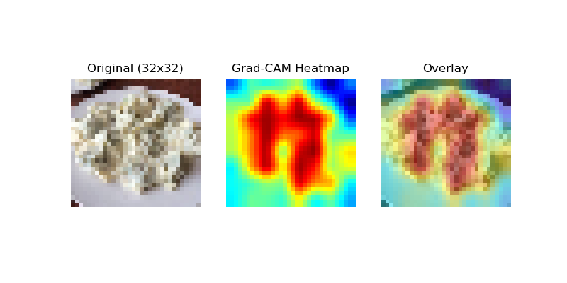

# Chinese_Food_Recognition
A Lightweight Chinese Cuisine Recognition System Based on Tensorflow

## ♥ 项目亮点 (Key Features)
- **轻量化设计 (Lightweight Architecture)**：专为边缘设备优化，模型参数量小，推理速度快。
- **可解释性分析 (Model Explainability)**：利用 Grad-CAM 进行了特征图可视化，直观展示模型对低分辨率菜品的核心关注区域。
- **丰富的数据分析 (Comprehensive Analysis)**：包含混淆矩阵分析、错误分析以及数据增强可视化脚本。

## 📚 实验结果 (Results & Visualization)
### 特征图可视化 (Grad-CAM)
这里展示你的模型聚焦在哪里，比如通过热力图看它是不是真的在看“菜”，而不是看“盘子”：
 

### 👍性能指标 (Metrics)
- **准确率 (Accuracy)**: XX% (在低分辨率/特定数据集上)

## 🛠️ 环境依赖 (Requirements)
- Python 3.x
- TensorFlow 1.x ⚠️ (请务必使用 1.x 版本，本项目基于 TensorFlow 1.x 架构开发)
- OpenCV, Matplotlib, NumPy

## 🚀 快速开始 (Usage)
1. 下载本项目并安装依赖。
2. 将数据集（`train.mat` 和 `test.mat`）放入项目根目录。
3. 运行主程序启动训练与评估：
   ```bash
   python main.py# Chinese_Food_Recognition
A Lightweight Chinese Cuisine Recognition System Based on Tensorflow
